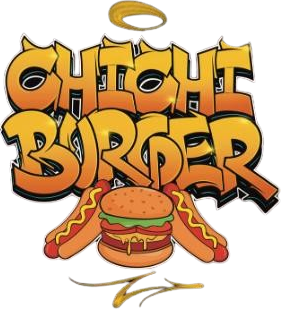

# 🍔 Chichi Burger - Landing Page Oficial

<p align="center">
  
</p>

<p align="center">
  <strong>El verdadero antojo de la noche en Cinco Colonias, Mérida.</strong>
</p>

<p align="center">
  <a href="https://vercel.com" target="_blank">
    
  </a>
  
  
</p>

---

## 📖 Descripción del Proyecto

Este repositorio contiene la **Landing Page Oficial de Chichi Burger**, una aplicación web de una sola página (Single Page Application) diseñada con un enfoque moderno, premium y de alta conversión. Su propósito es servir como el canal digital informativo y de pedidos del negocio ubicado en la colonia Cinco Colonias, en Mérida, Yucatán.

La página cuenta con una interfaz responsiva, una estética oscura sofisticada (carbón, brasa y mostaza) y múltiples llamados a la acción (CTAs) que redirigen al usuario directo a realizar su orden mediante **WhatsApp**, optimizando las ventas a domicilio y para llevar.

---

## ✨ Características Destacadas

*   **⚡ Conversión Rápida por WhatsApp:** Botones de orden integrados estratégicamente en la barra de navegación, la sección Hero, debajo del menú y un botón flotante permanente para la navegación móvil.
*   **🍱 Menú Bento Grid Interactivo:** Presentación visual de hamburguesas, hotdogs, botanas y refrescos. Incluye acordeones interactivos para ver las descripciones de ingredientes detalladas en cada hamburguesa y hotdog (abriendo solo uno a la vez).
*   **🕒 Indicador de Horario Activo en Tiempo Real:** Un badge dinámico en la sección de ubicación que muestra el estado del negocio ("Está por abrir", "Abierto ahora", "Por cerrar", "Cerrado por hoy") con colores visuales e indicador de pulso según la hora del sistema (actualizado automáticamente cada 30 segundos).
*   **💬 Sección de Preguntas Frecuentes (FAQ):** Acordeones interactivos para resolver dudas sobre servicio a domicilio (modalidad Pick Up), métodos de pago (tarjeta, transferencia y efectivo), tiempos de entrega y el menú secreto.
*   **🏷️ Extras como Badges/Chips:** Presentación visual moderna y limpia para los ingredientes adicionales de $15.
*   **📍 Integración de Google Maps:** Mapa embebido dinámicamente y botón de redirección ("Cómo llegar") optimizados para ubicar con exactitud la sucursal (`20.9379957, -89.6187928`).
*   **📱 Diseño Responsivo & Premium:** Adaptado al 100% para pantallas móviles, tablets y ordenadores con tipografías seleccionadas de Google Fonts (*Anton* e *Inter*) y el logo de la marca visible de forma responsiva en la cabecera.
*   **🚀 Optimización para Vercel:** Configuración lista para Vercel (`vercel.json`) con URLs limpias (oculta el `.html`) y directivas de almacenamiento en caché agresivas para cargar las imágenes y assets en milisegundos.

---

## 🛠️ Tecnologías Utilizadas

*   **HTML5** - Estructura semántica del sitio web.
*   **Tailwind CSS** - Framework de utilidades CSS de última generación para un diseño rápido y pulido (integrado vía CDN con configuraciones personalizadas).
*   **JavaScript (ES6)** - Lógica interactiva.
*   **Vercel** - Hosting estático en la nube con Edge Network.

---

## 📁 Estructura de Carpetas

```bash
ChichiBurguer/
├── assets/
│   ├── favicon/              # Favicons oficiales en múltiples formatos (.ico, .png)
│   ├── logo.png              # Logotipo oficial del negocio
│   └── burgers_and_hotdogs.png # Imagen de productos optimizada en el Hero
├── index.html                # Código fuente principal de la Landing Page
├── vercel.json               # Configuración de rutas y caché para Vercel
└── README.md                 # Documentación del proyecto
```

---

## 🚀 Cómo Ejecutar Localmente

Dado que el proyecto está construido con tecnologías web nativas, no necesitas herramientas complejas de compilación para ejecutarlo:

1.  Clona este repositorio:
    ```bash
    git clone https://github.com/tu-usuario/ChichiBurguer.git
    ```
2.  Entra a la carpeta del proyecto:
    ```bash
    cd ChichiBurguer
    ```
3.  Abre el archivo `index.html` en tu navegador preferido. 
    *   *Tip:* Puedes usar extensiones como **Live Server** en VS Code para recarga en tiempo real mientras editas el código.

---

## 📦 Despliegue en Vercel

Para desplegar tu proyecto en Vercel:

1. Instala el CLI de Vercel (opcional):
   ```bash
   npm i -g vercel
   ```
2. Ejecuta el comando de despliegue en la raíz del proyecto:
   ```bash
   vercel
   ```
3. Sigue las breves instrucciones en pantalla y ¡listo! Tu landing page estará activa con HTTPS y CDN global.

---

## 🍔 Chichi Burger Información de Negocio
*   **Ubicación:** C. 111 entre 48 y 50, Cinco Colonias, 97280 Mérida, Yuc.
*   **Horario:** Lunes a Domingo, de 7:00 p.m. a 12:00 a.m.
*   **Modalidad de Servicio:** Pick Up (Recoger en sucursal - sin servicio a domicilio por el momento).
*   **Métodos de Pago:** Efectivo, Transferencia y Tarjeta de Débito/Crédito.
*   **Contacto (WhatsApp):** [+52 999 304 3753](https://wa.me/529993043753)
*   **Facebook:** [Chichi Burger](https://www.facebook.com/people/Chichi-Burguer/61591155090389/)
*   **Instagram:** [@oficialchichiburguer](https://www.instagram.com/oficialchichiburguer/)
*   **TikTok:** [@chichiburgueroficial](https://www.tiktok.com/@chichiburgueroficial?lang=es)
